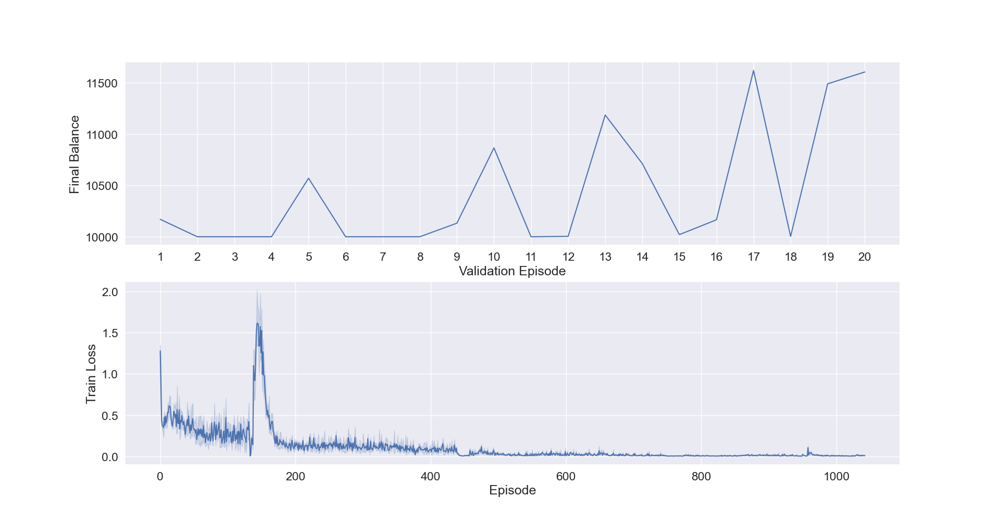
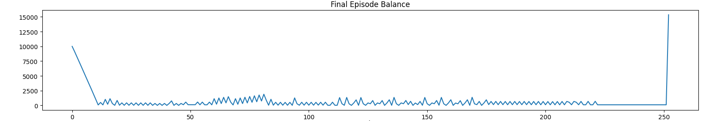

# RLTrader
A reinforcement learning based trading agent that uses Double Deep Q-Learning with Prioritized Experience Replay (DDQN w/ PER).

## How it works
Performs actions corresponding to buying or selling stocks within range of [-max_trans, max_trans] based on current state. The state is composed of the account balance, current number of owned stocks, previous stock closing prices, Moving Average Convergence Divergence (MACD) momentum indicator, and the MACD signal line.

Trains on multiple episodes of buying/selling stocks on randomly initialized start day, episode length, price scaling, and account balance. These randomized episodes are to help with robustness/generalization.  

## How to Run
Train the agent on 1000 episodes, and write out validation 
```shell
python3 main.py --epsilon 0.05 --batch_size 64 --n_episodes 1000 --max_train_days 512 --val_period 50 --lstm_timesteps 14
```

Test the agent
```shell
python3 main.py --epsilon 0.05 --batch_size 64 --n_episodes 1000 --max_train_days 512 --val_period 50 --lstm_timesteps 14 --load --run_test
```

List of all the CLI arguments are given in main.py. They can also be listed out by running:
```shell
python3 main.py --help
```

## Results
The final balance reflects the account balance + number of stocks * final stock closing price.  From the validation balance plot below, it is apparent that the policy is a bit unstable, even though the training loss continuously decreases.

Training plot using 14 timesteps and 10 maximum transactions


Final test results



I tested against two different baselines, one where you randomly buy/sell stocks and one where you only buy stocks and hold. Below the are the results on the testing set with an initial balance of $10,000.
Method | Final Balance
------------| -------------
Random      | $11914.115
DDQN w/ PER | $15355.321
Only Buy    | $15616.097


The DDQN w/ PER was able to do better than random, but not better than only buying stocks and holding.